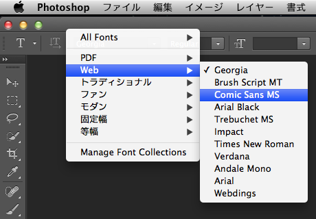

#ConceptualCase

Photoshop CS6 のフォントメニューを階層化する SIMBL プラグインです。[EasySIMBL](https://github.com/norio-nomura/EasySIMBL/) などで読み込んでください。
階層のグループは OS で設定されたものを使用します。「Manage Font Collections」を選択すると、Font Book.app を起動します。

Photoshop CS6 の体験版で動作確認しているため、体験版の試用期間が終わったら開発継続できなくなる可能性があります。
#Download
ビルド済みのバイナリは <http://hetima.com/tmp/ConceptualCase.zip> に

#License
MIT License

(C)hetima